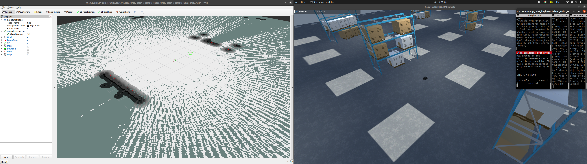

<h1 align="center">ros2-unity-turtlebot3</h1>

# ros2 unity setup
<!-- [](LICENSE.md) -->


use turtlebot3 in unity ros2

- [Unity-Robotics-Hub](https://github.com/Unity-Technologies/Unity-Robotics-Hub/tree/main)
- [Robotics-Nav2-SLAM-Example](https://github.com/Unity-Technologies/Robotics-Nav2-SLAM-Example)

Run unityhub: 
*Editor Version matter*: 2020.3.11f1 version.

`Open` -> `Robotics-Nav2-SLAM-Example/Nav2SLAMExampleProject`

**[Unity-Robotics-Hub](https://github.com/Unity-Technologies/Unity-Robotics-Hub/tree/main)** instrucs the setup for **unity install ROS2**

[setup](https://github.com/Unity-Technologies/Unity-Robotics-Hub/blob/main/tutorials/ros_unity_integration/setup.md)

In your workspace you need to add [ROS-TCP-Endpoint](https://github.com/Unity-Technologies/ROS-TCP-Endpoint) in your `src`.

Make sure to checkout **main-ros2**
```bash
$ git checkout main-ros2

# in your work space
# build
$ colcon build --packages-select ros_tcp_endpoint --cmake-force-configure --cmake-clean-cache
```

[Optional] If bridge is necessary:
```bash
$ roslaunch rosbridge_server rosbridge_websocket.launch 
```

You need to setup your IP address in unity and then launch this:
```bash
$ ros2 run ros_tcp_endpoint default_server_endpoint --ros-args -p ROS_IP:=127.0.0.1 -p ROS_TCP_PORT:=10000
```

### To control turtlebot3
```bash
$ ros2 run teleop_twist_keyboard teleop_twist_keyboard
```


Will appear the movements
```bash
$ ros2 topic echo /cmd_vel
```


## To view rviz2


In your workspace, add [unity_slam_example](https://github.com/Unity-Technologies/Robotics-Nav2-SLAM-Example/tree/main/ros2_docker/colcon_ws/src/unity_slam_example) in your `src` folder.

Now you will have two folder in `src`
- unity_slam_example
- ROS-TCP-Endpoint

```bash
# In your workspace build first
$ colcon build --symlink-install

$ ros2 launch unity_slam_example unity_slam_example.py
```


# [Optional] ros2 unity setup with build x86_64


[download](https://github.com/bmaxdk/ros2-unity-turtlebot3/tree/main/Unity_build)
```bash
$ chmod +x A1.x86_64
$ ./A1.x86_64
```

# Useful Sources:
- [For Connection](https://www.youtube.com/watch?v=pdMxLxolQuo&ab_channel=hrithikverma) (really uesful)
- [Connecting ROS to Unity: Using ROS# and ROSBridge](https://www.youtube.com/watch?v=OZiAJuWh6w8&ab_channel=TheRealFran)

-[ROS2-Unity Setup Tutorial](https://www.youtube.com/watch?v=1F9AemL27Ek&ab_channel=SORASITTATITAISAKUL) (Will visualizely help.)

-[ROS2 UNITY MODELLING, SIMULATION, AND CONTROL](https://www.youtube.com/watch?v=5BiC0bxL_jg&ab_channel=TampereUniversityRobotics)


[Fixed] Error appeared in:
To build unity error appeared to build.
`/Robotics-Nav2-SLAM-Example/Nav2SLAMExampleProject/Library/PackageCache/com.unity.robotics.warehouse@9fa61061d3/Scripts/Runtime/PerceptionRandomizers/FloorBoxRandomizerShim.cs`

Fixed:
```cs
using System.Collections.Generic;
using System;
using Unity.Robotics.PerceptionRandomizers.Shims;
using UnityEngine;
#if UNITY_EDITOR
using UnityEditor;
#endif
using UnityEngine.Perception.Randomization.Parameters;
using UnityEngine.Perception.Randomization.Randomizers;
using UnityEngine.Perception.Randomization.Randomizers.SampleRandomizers.Tags;
using UnityEngine.Perception.Randomization.Samplers;
using Unity.Simulation.Warehouse;
using UnityEngine.Perception.Randomization.Scenarios;
using Object = UnityEngine.Object;

[Serializable]
[AddRandomizerMenu("Robotics/Floor Box Randomizer")]
public class FloorBoxRandomizerShim : RandomizerShim
{
    public int numBoxToSpawn;
    public int maxPlacementTries = 100;
    FloatParameter random = new FloatParameter {value = new UniformSampler(0f, 1f)};

    SurfaceObjectPlacer placer;
    GameObject parentFloorBoxes;
    List<CollisionConstraint> constraints;
    CollisionConstraint turtleConstraint;
    AppParam appParam;
    ShelfBoxRandomizerShim m_ShelfBoxRandomizerShim;

    protected override void OnAwake()
    {
        if (WarehouseManager.instance == null)
        {
            var warehouseManager = GameObject.FindObjectOfType<WarehouseManager>();
            appParam = warehouseManager.appParam;
        }
        // Add collision constraints to spawned shelves
        var tags = tagManager.Query<ShelfBoxRandomizerTag>();
        if (!Application.isPlaying)
            tags = GameObject.FindObjectsOfType<ShelfBoxRandomizerTag>();

        constraints = new List<CollisionConstraint>();

        foreach (var tag in tags)
        {
            var shelf = new CollisionConstraint(tag.transform.position.x, tag.transform.position.z, tag.GetComponentInChildren<Renderer>().bounds.extents.x);
            constraints.Add(shelf);
        }

        base.OnAwake();
    }

    protected override void OnScenarioStart()
    {
        var scenario = GameObject.FindObjectOfType<Scenario<ScenarioConstants>>();
        m_ShelfBoxRandomizerShim = scenario.GetRandomizer<ShelfBoxRandomizerShim>();
        base.OnScenarioStart();
    }

    protected override void OnIterationStart()
    {
        if (GameObject.Find("GeneratedWarehouse") == null)
            return;

        // Create floor boundaries for spawning
        var bounds = new Bounds(Vector3.zero, new Vector3(appParam.width, 0, appParam.length));
        placer = new SurfaceObjectPlacer(bounds, random, maxPlacementTries);

        // Instantiate boxes at arbitrary location
        parentFloorBoxes = new GameObject("FloorBoxes");
        for (int i = 0; i < numBoxToSpawn; i++) 
        {
            //GameObject o;
            GameObject o = new GameObject();
            if (!Application.isPlaying)
            {
            	#if UNITY_EDITOR
                o = PrefabUtility.InstantiatePrefab(m_ShelfBoxRandomizerShim.GetBoxPrefab()) as GameObject;
                #endif		
                o.transform.parent = parentFloorBoxes.transform;
            }
            else
                o = Object.Instantiate(m_ShelfBoxRandomizerShim.GetBoxPrefab(), parentFloorBoxes.transform);
            o.AddComponent<FloorBoxRandomizerTag>();
            o.AddComponent<RotationRandomizerTag>();
        }

        // Begin placement interation
        placer.IterationStart();
        
        var tags = tagManager.Query<FloorBoxRandomizerTag>();
        if (!Application.isPlaying)
            tags = GameObject.FindObjectsOfType<FloorBoxRandomizerTag>();

        foreach (var tag in tags)
        {
            bool success = placer.PlaceObject(tag.gameObject);
            if (!success)
            {
                return;
            }
        }
    }

    protected override void OnIterationEnd()
    {
        if (!Application.isPlaying)
                Object.DestroyImmediate(parentFloorBoxes);
            else
                Object.Destroy(parentFloorBoxes);
    }
}

```