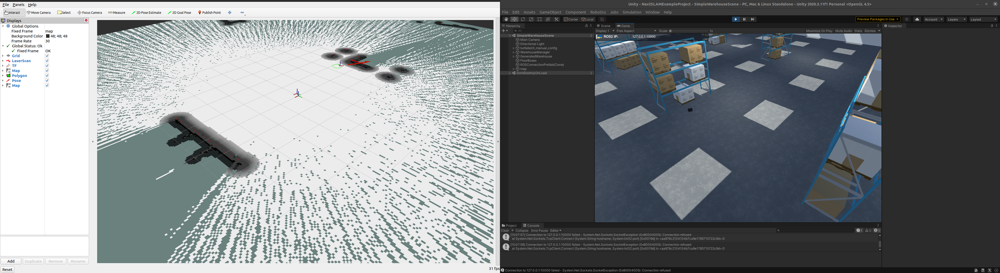
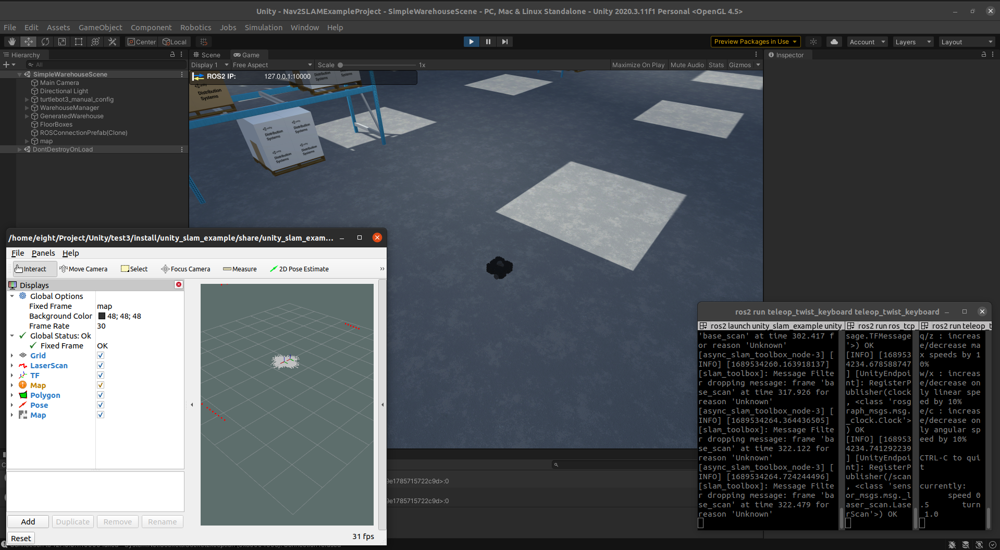

# ros2-unity-turtlebot3
[](LICENSE.md)



use turtlebot3 in unity ros2

- [Unity-Robotics-Hub](https://github.com/Unity-Technologies/Unity-Robotics-Hub/tree/main)
- [Robotics-Nav2-SLAM-Example](https://github.com/Unity-Technologies/Robotics-Nav2-SLAM-Example)

Run unityhub: 
*Editor Version matter*: 2020.3.11f1 version.

`Open` -> `Robotics-Nav2-SLAM-Example/Nav2SLAMExampleProject`

**[Unity-Robotics-Hub](https://github.com/Unity-Technologies/Unity-Robotics-Hub/tree/main)** instrucs the setup for **unity install ROS2**

[setup](https://github.com/Unity-Technologies/Unity-Robotics-Hub/blob/main/tutorials/ros_unity_integration/setup.md)

In your workspace you need to add [ROS-TCP-Endpoint](https://github.com/Unity-Technologies/ROS-TCP-Endpoint) in your `src`.

Make sure to checkout **main-ros2**
```bash
$ git checkout main-ros2

# in your work space
# build
$ colcon build --packages-select ros_tcp_endpoint --cmake-force-configure --cmake-clean-cache
```

[Optional] If bridge is necessary:
```bash
$ roslaunch rosbridge_server rosbridge_websocket.launch 
```

You need to setup your IP address in unity and then launch this:
```bash
$ ros2 run ros_tcp_endpoint default_server_endpoint --ros-args -p ROS_IP:=127.0.0.1 -p ROS_TCP_PORT:=10000
```

### To control turtlebot3
```bash
$ ros2 run teleop_twist_keyboard teleop_twist_keyboard
```


Will appear the movements
```bash
$ ros2 topic echo /cmd_vel
```


## To view rviz2


In your workspace, add [unity_slam_example](https://github.com/Unity-Technologies/Robotics-Nav2-SLAM-Example/tree/main/ros2_docker/colcon_ws/src/unity_slam_example) in your `src` folder.

Now you will have two folder in `src`
- unity_slam_example
- ROS-TCP-Endpoint

```bash
# In your workspace build first
$ colcon build --symlink-install

$ ros2 launch unity_slam_example unity_slam_example.py
```


# Useful Sources:
- [For Connection](https://www.youtube.com/watch?v=pdMxLxolQuo&ab_channel=hrithikverma) (really uesful)
- [Connecting ROS to Unity: Using ROS# and ROSBridge](https://www.youtube.com/watch?v=OZiAJuWh6w8&ab_channel=TheRealFran)

-[ROS2-Unity Setup Tutorial](https://www.youtube.com/watch?v=1F9AemL27Ek&ab_channel=SORASITTATITAISAKUL) (Will visualizely help.)

-[ROS2 UNITY MODELLING, SIMULATION, AND CONTROL](https://www.youtube.com/watch?v=5BiC0bxL_jg&ab_channel=TampereUniversityRobotics)
